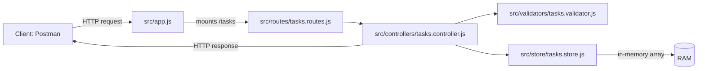

# Task Manager API (Express + In‑Memory Store)

A small RESTful API for managing tasks using **Node.js** and **Express.js**, with an **in-memory data store** (no database).  
It supports CRUD operations, validation + error handling, and optional extensions like filtering, sorting, and priority.

## What this project does

- Create, read, update, and delete tasks
- Validate input (title/description required, completed must be boolean, optional priority)
- Return appropriate errors (400 for bad input, 404 for missing task)
- Provide optional query features:
  - Filter by completion: `GET /tasks?completed=true|false`
  - Sort by creation time: `GET /tasks?sort=createdAt&order=asc|desc`
  - Priority support: `low | medium | high` and `GET /tasks/priority/:level`

## Data model (Task)

Example task:

```json
{
  "id": 2,
  "title": "Create a new project",
  "description": "Create a new project using Magic",
  "completed": false,
  "priority": "medium",
  "createdAt": "2026-04-28T12:00:00.000Z"
}
```

Notes:
- `id` is auto-generated
- `createdAt` is set when the task is created (or when initial tasks are loaded)
- `priority` defaults to `"low"` if not provided

## Project structure

```text
.
├─ app.js                      # exports the Express app (used by tests)
├─ index.js                    # starts the server (node index.js)
├─ src/
│  ├─ app.js                   # Express app: middleware + route mounting
│  ├─ routes/
│  │  └─ tasks.routes.js        # /tasks routes (relative paths)
│  ├─ controllers/
│  │  └─ tasks.controller.js    # request handlers (validation + responses)
│  ├─ store/
│  │  └─ tasks.store.js         # in-memory store + CRUD helpers
│  └─ validators/
│     └─ tasks.validator.js     # input validation rules
├─ task.json                   # initial seed data (loaded on startup)
└─ test/
   └─ server.test.js           # automated tests
```

## Request flow (high-level)



## Setup

### 1) Install dependencies

```bash
npm install
```

### 2) Configure environment (optional)

This project supports `.env` for configuration.

- Create a local `.env` file (do **not** commit it):

```bash
cp .env.example .env
```

- Default variable:
  - `PORT=3000`

### 3) Start the server

```bash
node index.js
```

Server will run at:
- `http://localhost:3000`

## Run tests

```bash
npm test
```

## API documentation

Base URL: `http://localhost:3000`

## Testing with Postman

1. Open Postman → **New** → **HTTP Request**
2. Set the request URL to `http://localhost:3000`
3. For **POST/PUT**, go to **Body** → **raw** → select **JSON**
4. Postman automatically sets `Content-Type: application/json` for raw JSON, but you can confirm it in **Headers**

### 1) GET `/tasks`

Retrieve all tasks.

**200 OK** → returns `[]` or an array of tasks.

- **Method**: GET
- **URL**: `{{baseUrl}}/tasks`
- **Expected**: 200 OK with JSON array

Tip: In Postman, set an environment variable:
- `baseUrl = http://localhost:3000`

#### Optional: filter by completion

`GET /tasks?completed=true` or `GET /tasks?completed=false`

- **Method**: GET  
- **URL**: `{{baseUrl}}/tasks?completed=true`
- **Expected**: 200 OK with tasks where `completed` is `true`

#### Optional: sort by creation date

`GET /tasks?sort=createdAt&order=asc` (or `order=desc`)

- **Method**: GET  
- **URL**: `{{baseUrl}}/tasks?sort=createdAt&order=asc`
- **Expected**: 200 OK with tasks sorted by `createdAt`

### 2) GET `/tasks/:id`

Retrieve a specific task by ID.

- **200 OK** → returns the task
- **404 Not Found** → task doesn’t exist or ID is invalid

- **Method**: GET  
- **URL**: `{{baseUrl}}/tasks/1`  
  - **Expected**: 200 OK

- **Method**: GET  
- **URL**: `{{baseUrl}}/tasks/999`  
  - **Expected**: 404 Not Found

- **Method**: GET  
- **URL**: `{{baseUrl}}/tasks/abc`  
  - **Expected**: 404 Not Found

### 3) POST `/tasks`

Create a new task.

**Body (required):**
- `title` (string, not empty)
- `description` (string, not empty)
- `completed` (boolean)

**Body (optional):**
- `priority`: `low | medium | high`

Responses:
- **201 Created** → returns created task
- **400 Bad Request** → invalid input

- **Method**: POST  
- **URL**: `{{baseUrl}}/tasks`  
- **Body** (raw JSON):

```json
{ "title":"New Task","description":"New Task Description","completed":false,"priority":"high" }
```

- **Expected**: 201 Created + JSON task (with `id`, `createdAt`)

Invalid example (missing fields):

- **Method**: POST  
- **URL**: `{{baseUrl}}/tasks`  
- **Body** (raw JSON):

```json
{ "title":"Only title" }
```

- **Expected**: 400 Bad Request + `{ "error": "..." }`

### 4) PUT `/tasks/:id`

Update an existing task by ID.

**Body is the same schema as POST** (title, description, completed required; priority optional).

Responses:
- **200 OK** → returns updated task
- **400 Bad Request** → invalid input
- **404 Not Found** → task doesn’t exist or ID is invalid

- **Method**: PUT  
- **URL**: `{{baseUrl}}/tasks/1`  
- **Body** (raw JSON):

```json
{ "title":"Updated","description":"Updated Description","completed":true,"priority":"medium" }
```

- **Expected**: 200 OK + updated task JSON

### 5) DELETE `/tasks/:id`

Delete a task by ID.

Responses:
- **200 OK** → deleted successfully
- **404 Not Found** → task doesn’t exist or ID is invalid

- **Method**: DELETE  
- **URL**: `{{baseUrl}}/tasks/1`  
  - **Expected**: 200 OK

- **Method**: DELETE  
- **URL**: `{{baseUrl}}/tasks/999`  
  - **Expected**: 404 Not Found

### 6) GET `/tasks/priority/:level`

Retrieve tasks by priority.

Valid levels: `low`, `medium`, `high`

Responses:
- **200 OK** → returns matching tasks (possibly empty array)
- **404 Not Found** → invalid priority level

- **Method**: GET  
- **URL**: `{{baseUrl}}/tasks/priority/high`  
  - **Expected**: 200 OK

- **Method**: GET  
- **URL**: `{{baseUrl}}/tasks/priority/urgent`  
  - **Expected**: 404 Not Found

## Quick manual test checklist

- Create a valid task → expect **201**
- Create an invalid task (missing description/completed) → expect **400**
- Fetch tasks → expect **200** and an array
- Fetch a task that exists → expect **200**
- Fetch a task that doesn’t exist → expect **404**
- Update a task with invalid `completed` type → expect **400**
- Delete a task that doesn’t exist → expect **404**
- Filter: `?completed=true` works
- Sort: `?sort=createdAt&order=asc` works
- Priority route: `/tasks/priority/high` works

---

## Note: Testing with curl (optional)

If you prefer the terminal, you can test the same endpoints using curl:

```bash
# GET all tasks
curl http://localhost:3000/tasks

# GET task by id
curl -i http://localhost:3000/tasks/1

# POST create task (valid)
curl -i -X POST http://localhost:3000/tasks \
  -H "Content-Type: application/json" \
  -d '{ "title":"New Task","description":"New Task Description","completed":false,"priority":"high" }'

# PUT update task (valid)
curl -i -X PUT http://localhost:3000/tasks/1 \
  -H "Content-Type: application/json" \
  -d '{ "title":"Updated","description":"Updated Description","completed":true,"priority":"medium" }'

# DELETE task
curl -i -X DELETE http://localhost:3000/tasks/1

# Filter + sort
curl "http://localhost:3000/tasks?completed=true"
curl "http://localhost:3000/tasks?sort=createdAt&order=asc"

# Priority route
curl http://localhost:3000/tasks/priority/high
```

